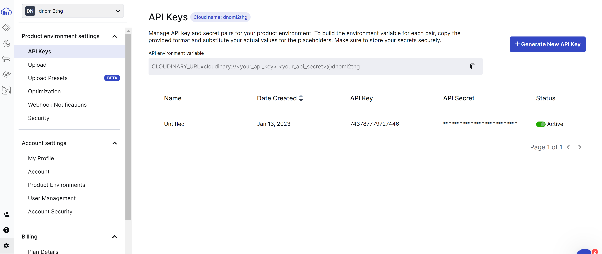
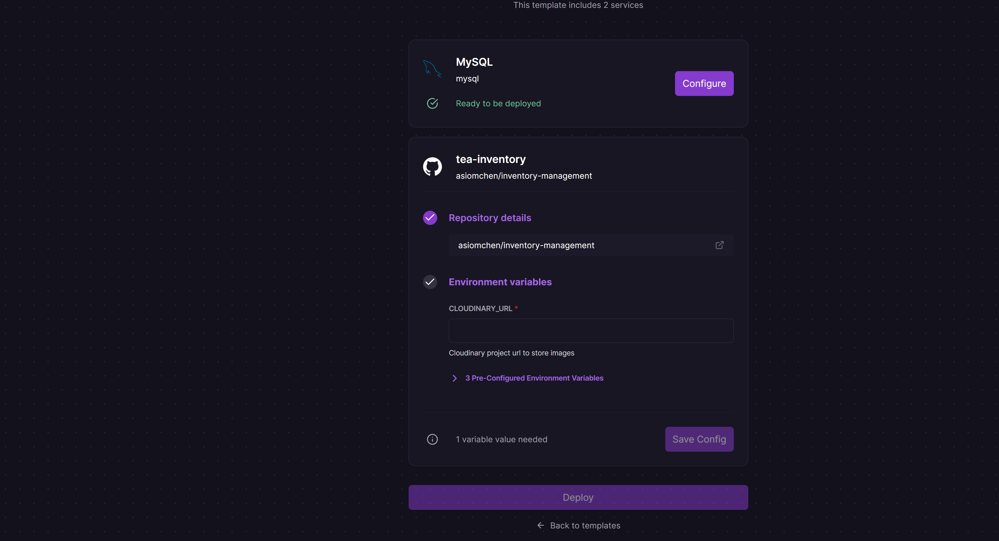

# inventory-management tea

To deploy your own instance of this app, click the button above. You will need to sign in with your GitHub account, and then Railway will guide you through the deployment process.

To deploy this app, you will need to have a Railway account. If you don't have one, you can sign up for free [here](https://railway.app).

Also for storing the imgaes you need to have a cloudinary account. If you don't have one, you can sign up for free [here](https://cloudinary.com).

Cloudinary free tier is quite generous and should be enough for most use cases.

After logging in, you will be asked to enter only one environment variable:

- `CLOUDINARY_URL`: This is the URL of your Cloudinary project. You can find this in the Cloudinary dashboard under the "Settings --> Programmable Media --> API Keys" section. It should look something like this: `cloudinary://<your_api_key>:<your_api_secret>@your_cloud_name`.                                                                                                                                                

In railway, you can then add this environment variable in template settings.

After clicking the "Deploy" button, Railway will start building and deploying your app. This process will take a few minutes. 

After the deployment is complete, you will be able to view your app by going to the URL visible in the "Deployments" section of the project dashboard.

Password would be automatically generated and you can find it in the `MAIN_PASSWORD` environment variable in the Railway dashboard "Variables" section.

Note: The password cannot be changed after the deployment. To avold password guessing attacks, after 10 wrong attempts, the user will be locked out for 10 minutes. Password is generated randomly by Railway and should secure enough for most use cases.